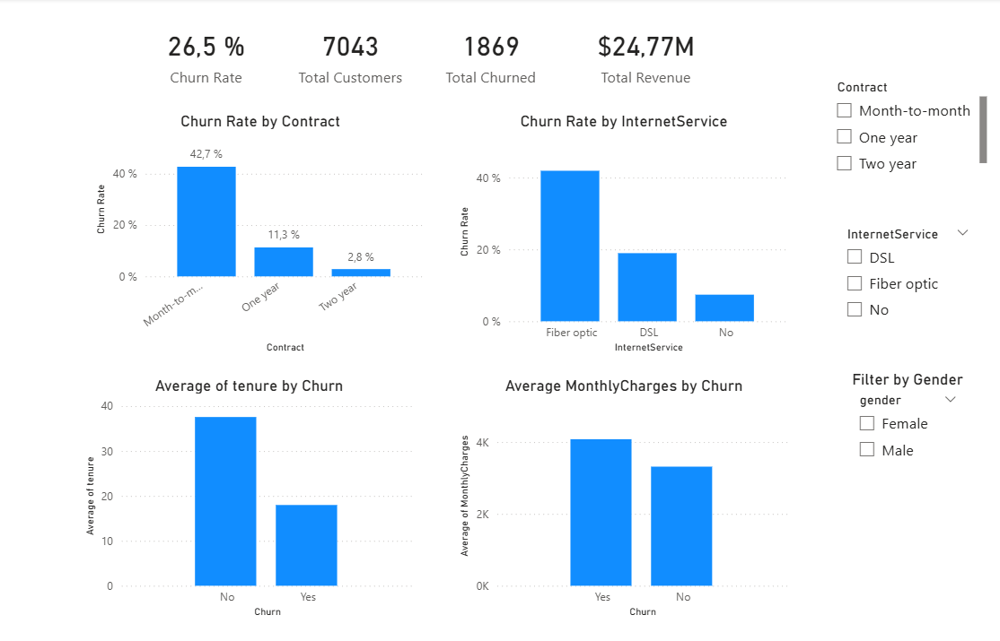

# 📊 Telco Customer Churn Analysis  
**End-to-End Data Analytics Project**

---

## 🔍 Project Overview
This project analyzes **customer churn** in a telecom company to identify the key drivers affecting customer retention and revenue loss.

**Tools & Technologies:**  
Python (Pandas, Matplotlib), Power BI, DAX, Data Cleaning, Data Visualization

---

## 🎯 Business Problem
The company is experiencing a **26.5% customer churn rate**, leading to significant revenue loss.

**Objective:**  
Understand **who is churning**, **why they are leaving**, and **what actions can help reduce churn**.

---

## 🧠 Key Insights
- Month-to-month customers have the **highest churn rate (42.7%)**
- **Fibre optic users** show the highest churn among internet services
- **Higher-paying customers** tend to churn more
- **Low-tenure customers** leave early, indicating onboarding issues

---

## 📈 Dashboard Preview

Power BI dashboard showcasing churn KPIs and insights

  

